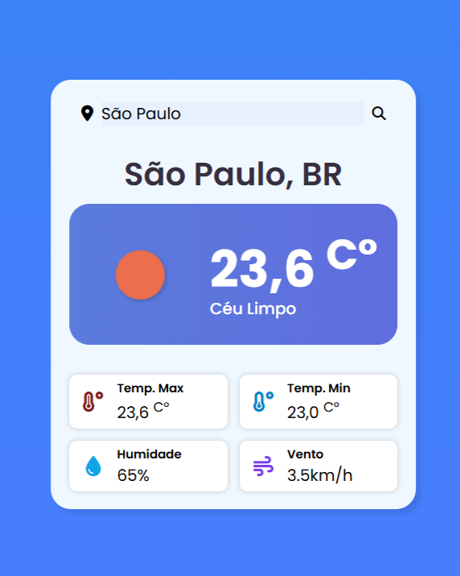

# ⛅ Weather Forecast

[Traduzir para Português](https://github.com/sthefanyalaminos/weather-forecast/blob/main/README.MD)

A web-based weather forecast application built with **HTML**, **CSS**, and **JavaScript**. The project fetches real-time weather data from an API and displays it in a simple, intuitive interface.

<a href="https://sthefanyalaminos.github.io/weather-forecast/">Click here to access!</a>

## Features

- Search weather forecast by city;
- Display of temperature, weather condition, and corresponding icon;
- Responsive interface, adapted for desktop and mobile;
- Visual feedback for city not found / search errors.

## Technologies used

- **HTML5** – Application structure.
- **CSS3** – Styling and responsiveness.
- **JavaScript** – Search logic, DOM manipulation, and API consumption.
- **OpenWeatherMap** – Source of weather data.

## Purpose

This project was developed as a practice of front-end fundamentals (HTML, CSS, and JavaScript), with a focus on API consumption and DOM manipulation.

## Author

Developed by **Sthefany Alaminos**